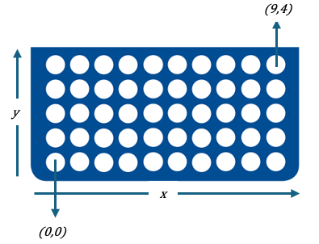
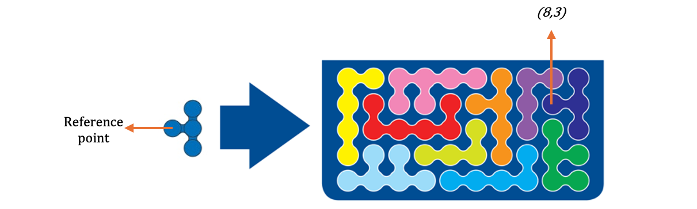
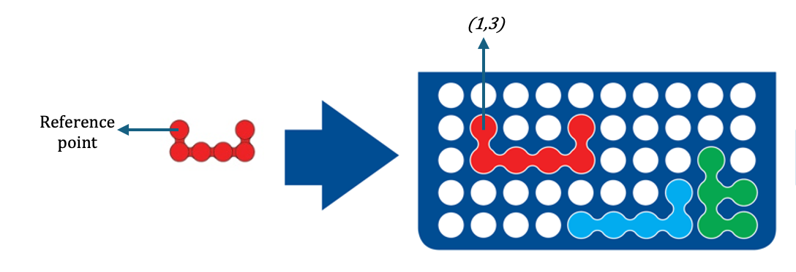

## TL;DR

🧩 [IQ Fit](https://smartgames.eu/uk/one-player-games/iq-fit) is an award winning 3D puzzle game, which turns out to be a combinatorial problem! 

🧮 You can formulate it as a MIP, a pure Binary Program to be more precise.

👨‍👧 It is more fun to play it with your daughter/son rather than formulating.

## Background

A few weeks ago while walking in a toys shop, my daughter showed us a 3D puzzle game.
She told us that she plays with it at school and likes it a lot. 

The idea of the game is, similar to any other puzzle, is pretty straightforward: 
you have pieces, and you have a board that you need to completely fill. 
The catch is, the pieces are 3D but the board is 2D. 
Hence, the player needs to orientate the pieces such that they fill up the board and keep the 2D.

I found this fabulous [blog post](iq-fit_example-899.png) about the game, by Raf Peeters, the designer,
where he explains more.

## Understanding the game

Let me summarize the facts about the puzzle:
- The board has 50 holes, formed as a 5 by 10 matrix
- There are 10 pieces, each with different color
- Each piece has 2 _usable_ sides
- A challenge is defined by a certain placement of a subset of the pieces and the goal is
 to fill up the board entirely with the remaining ones

Below image shows an example challenge (_left_) and its solution (_right_): 

## Modeling

As a mathematical optimization practitioner, inevitably I started formulating the game in my mind
as a _mathematical optimization model_ while we played it.
For the general audience, in short: 

> Mathematical optimization is the process of finding a **_solution_** to a **_problem_**,
> where the **_solution_** minimizes (or maximizes) a certain **_objective_**.
> A mathematical model represents a problem with **_variables_**
> and **_constraints_**. The former correspond to _decisions_ while the latter correspond to actual and/or desired limitations.

Let's start with defining what our decisions are. A way to look at it is as follows: 
we select one of the remaining pieces and place it to the board in a _certain_ way.
As defined above, each piece has 2 _usable_ sides.
Raf Peeters provides a beautfiul representation of the pieces as:

This representation is, however, incomplete for our purposes since it misses the orientation of the side.
Let's take a side of the dark blue piece for instance. You can place it on the board in 4 different orientations:

### Variables
The player chooses one side and one orientation to place on the board for each piece.
Let $C$ be the set of colors and $O$ be the exhaustive set of combinations of a side and orientation for each color.
Then $o(c)$ will represent a certain color, side and orientation. Let's call $o(c)$ an option of color $c$.

To represent placement of a piece on the board, let's first determine the way we represent the board itself.
It consists of 50 holes, shaped as a 5 by 10 matrix. Intuitively, we can represent each hole as a point, $(x,y)$.
Let's denote the bottom left as $(0,0)$, namely the origin.

Our task is to place the pieces onto the board. 
For that, having a reference point of $o(c)$, namely the option, would be handy.
We can then relatively express every other _ball_ or _point_ of the option.
Our decision will be: **_"where the reference point
of the option will be placed in the board"_**. Although, this is intuitive for human intelligence,
from mathematical point of view, following is handier: 
**_"the reference point of the option is placed to $(x,y)$, or not."_**. Then our decision variable is:

$$
    x_{o(c),p} = 
    \begin{cases}
      1 &\text{if $o(c)$ is placed at point $p$} \\\\
      0 &\text{otherwise }
    \end{cases}
$$

Let's circle back to the example above and focus on the placement of the dark blue piece.
Below image points which _ball_ we assume to be the reference point and its placement at
$(8,3)$ on the board. Note that it is not possible to place this piece with the same orientation
at $(8,4)$, since one _ball_ will be out of the board. 

To generate exahustive list of options,
one can determine a reference point for all colors, sides and orientations, enumerate all the points of the board 
and check whether the piece fits in the board entirely.

### Constraints

The first rule and the objective of the game is to fill up the board entirely. 
In other words, each point on the board needs to have exactly 1 ball assigned to it.
Let's define set $(O,P)(p)$ such that if the reference point of orientation $o(c)$ of color $(c)$
is placed at $p$, then one of the _balls_ of the piece is filling up point $p$. 

In the example above, when the reference point of dark blue piece is placed at $(8,3)$, 
following points are filled with dark blue: $\{(8,3),(9,3), (9,4), (9,2)\}$. 
Then, in order to make sure that all the points in the board are filled, 
we can express the constraint as follows:

$$
  \sum_{o(c), p' \in (O,P)(p))} x_{o(c),p'} = 1 \quad \forall p
$$

Constraints are elements of a mathematical model that determines whether a solution is feasible.
However, counter intuitively, we also need to express the _physical_ restrictions as well.
Anyone playing this game knows by heart that he/she needs to use each piece exactly once.
Below constraint expresses the same thing, only cooler:

$$
  \sum_o x_{o(c),p} = 1 \quad \forall c
$$

### Objective
 
Probably the easiest part is the objective: there is _none_. 
Since we expressed the objective of filling up the entire board as a constraint, the model becomes a feasibility problem.
Hence, we can leave it blank:

$$
  min \quad 0
$$

## How to input a challenge?

A challenge is defined as fixed placement of subset of the pieces. Then inputting a challenge to the model
means enforcing those selections. Circling back to the example challenge above, to fix the red piece
we need to fix the variable corresponding to reference point placement to $(1,3)$ as below image illustrates:

## Conclusion

First of all, kudos to Raf Peeters, for designing this brilliant game. Even though it was a fun
practice to formulate it, to be honest, I prefer playing the challenges with my daughter 
and the hardest ones with my wife. 
Moreover, even though I formulated it as a mathematical
optimization model, it is rather a feasibility problem since there's no objective to optimize for.
Formulating it as a constraint programming model can be also a good practice, to also touch upon constraint satisfaction phenomenon.

